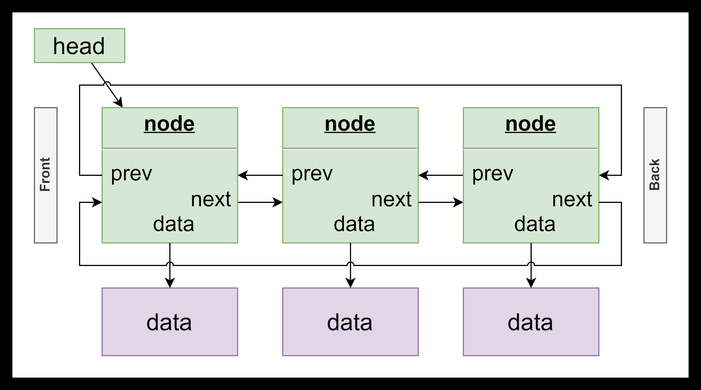

[](https://classroom.github.com/open-in-codespaces?assignment_repo_id=13458546)
# ASSIGNMENT 2: *Vish* (Visual Shell)

## CAAL241

### <u>General</u> 🎖️

1. You are allowed to submit the assignment in a group of up to 3 students.

2. If you do choose to collaborate as a group, you adhere to the following:

   *All group members are responsible for any disciplinary violation committed by any individual within the group, regardless of whether they were aware of it.*

   Therefore, it's crucial to form groups only with individuals whom you trust.

3. Groups of 3 students are required to complete all bonus tasks as mandatory requirements (failure to do so will lead to a deduction of points equivalent to the bonus points value).

4. General questions (i.e., questions that do not contain personal information and/or parts of the solution) must be posted at the assignment forum. Personal messages with this nature of questions will be ignored.

5. You are responsible to regularly check the assignment forum for updates (you can subscribe to receive automatic updates about new posts if you like).

6. Updates may be done directly into your repository. These will be announced in the forum. Once an update is announced, you are required to merge it into your code as soon as possible.

7. You are not allowed to use any code created by generative AI tools (such as ChatGPT, GitHub Copilot, etc.).

8. Any code longer than 3 lines that you copy from an online source must be marked with a comment before it as follows (assuming X lines were copied here from `http://some.web/site`):

   `// X lines source: http://some.web/site`

9. **Plagiarism or any other form of cheating will result in serious disciplinary measures.**
10. You are required to have <u>comprehensive understanding</u> of the <u>entire solution</u> you submit - including those sections contributed by your assignment partner (or partners).
11. Note that I may, at my discretion, ask some students to present an oral defense of their work.
12. You are required to push updates to the GitHub server often (these may help prove your work). If you do not know, or run into any trouble with Git, ask for help and solve the matter as soon as possible (and if you do not address this kind of issues you also risk losing your code!).

**It is <u>your responsibility</u> to understand and follow the instructions correctly.**

**NO EXECUSES AFTER-THE-FACT WILL BE ACCEPTED** ❗

------

#### <u>Description</u> 📖

In this exercise you will write *vish* - a shell that is like a limited version of *bash*, but a special visual feature.

The assignment is divided into modules. The *Main Module* is the file `main.c` and the rest are the *Tokenizer Module*, *Executor Module*, *History Module* and *List Module*, as described below.

#### <u>Solution Files</u> 🗂️

You have been provided with a working solution to the assignment in the `solution` directory.

To make it easier for you, the object files of the solution are also in the `solution` directory. You can use them in order to test and see how well your code works.

In order to compile your program with one (or more) of the solution's object files, you should copy the object file from the `solution` directory to the `bin` directory and run `make`.

For example, to compile your project with `exec.o` from the solution directory:

```
$ cp solution/exec.o bin
$ make
```

Note that if you change the file `exec.c` afterwards and run `make`, the file `exec.o` may be replaced with your file and you will need to execute these commands again in order to use the solution's `exec.o` again.

#### <u>Special Instructions</u> 📝

- You are not allowed to add any global variables anywhere in the program.
- You are not allowed to change the header files.
- You must use the provided function where applicable (you are <u>not</u> allowed to ignore them and write your own implementations).
- You may add helper functions as you like, as long as they do not <u>replace</u> the provided functions.

### <u>Tokenizer Module</u> 🧩

This module is a bash-like input line tokenizer (a tokenizer is a program or function that breaks a string into parts). *Note: the tokenizer behavior is similar to bash, but not identical.*

The tokenizer code is split in 2 parts: 

- In `tokens.c` the function `getTokens` accepts a pointer to the beginning of the input line, and returns  an array of tokens (strings). The array of tokens is terminated by an extra null pointer at the end.
- In `token.c` the function `getToken` accepts a pointer to a the current location in the input line and returns the next token (and moves the pointer the position in the line after the token).

You must dynamically allocate the memory for the token array, and the memory for each token. **However, you may assume that the maximum number of tokens per command line is MAX_TOKENS and the maximum number of characters in each token is MAX_TOKEN_LEN.** 

###### *Bonus 1: without using any additional memory, pre-calculate the number of tokens and allocate the exact size required for the token array, and pre-calculate the length of each token string and only allocate the exact size required for each token.* 

*Note: do not forget to add room for the terminating null pointer at the end of the token array and a terminating null character for each token.*

The tokenizer you will write should act similarly to the way `bash` breaks a string into program arguments;

- Unquoted text (any text not inside single or double quotes):
  - Whitespace and starting quotes are normally considered token separators except after a backslash.
  - Backslash characters are removed, except a backslash after backslash ( `\\` ).
- Text in single quotes ( `'` ):
  - Whitespace and starting quotes are not considered token separators.
  - Quote ends at the next single-quote character that is not after a backslash.
  - Backslash characters are removed only when before a single-quote character.
- Text in double quotes ( `"` ):
  - Whitespace and starting quotes are not considered token separators.
  - Quote ends at the next double-quote character that is not after a backslash.
  - Backslash characters are removed only when before a double-quote character.
- Consecutive whitespace characters <u>between</u> tokens are ignored.

###### Note: to better understand this requirement, run `./test` with different arguments from the provided solution program and examine the behavior.

### <u>Executor Module</u> 🌈

The purpose of this module is to execute Linux commands and recolor the output. 

In the file `vish` there is a main function that displays a bash-like prompt, accepts an input line from the user and executes the command.

**There are 3 commands that are performed by the shell, and the rest are executed by creating a process and running the program given in the command (if it exists): *cd*, *exit* and *history*.**

The commands performed by the shell are:

- ***cd***: similar to `bash`'s **cd** command - must change the current directory of the shell and update the prompt accordingly (implement the code of the function `cd` in `vish.c`).
- ***exit***: prints `exit` and terminates.
- ***history***: prints the input lines history (see later).

Any other input (except an empty line) must be parsed into tokens and executed.

The functions in the file `exec.c` handle the execution (see the comments in the file). 

The line must be executed by a child process who's output is redirected to a pipe.

**The parent process must read from the pipe and output <u>each letter in a different color</u>, until the child process terminates.**

If the child process terminates with an error, an error must be printed by the <u>parent</u> process in <u>red</u> (this code has already been provided to you in `exec.c`).

### <u>History Module</u> 📜

The purpose of this module is to support a "history" shell feature (similar to the history in bash). It keeps the history of all input lines written since the process was started (implemented in the file `history.c`).

**You must handle the up and down arrow keys and the `history` command. and use an instance of the linked list from task 4 to save the history (note the global variables in `history.c`).**

- The `history` command prints the history of all input lines since the shell was run.
- The *up* and *down* arrow keys cycle through the input lines history.
- When the <u>first</u> input line is reached (by pressing the up arrow key), the input line is cycled back to the first line in the history (this is different from how it is in `bash`).
- Similarly, pressing the down arrow key at the <u>last</u> input line cycles to the first input line in the history.
- The line is not duplicated (added to the history) if it is the same as the last line the user entered (i.e., if the user enters the same command several times in a row, it is only saved once).

###### Note: to better understand this requirement, run the provided solution and examine the behavior.

### <u>List Module</u> 🔗

This is a stand-alone implementation of a generic, cyclic, double-linked list.

This entails the following characteristics:

- *Double-linked:* every node holds a pointer to both the next and the previous node.
- *Cyclic:* the first node's *previous* is the last node and the last node's *next* is the first node.
- *Generic:* the data is a void pointer that can point to anything.

**Important: In the file `list.c` you are only required to implement the functions you need in order to implement task 3** (you can ignore any functions that you do not need). **However, the internal mechanism and structure of the list must be encapsulated** (meaning that it is not exposed to other files so in order to use it you <u>must</u> call the functions in `list.h`).

###### *Bonus 2: implementing <u>all</u> the functions in `list.c` (correctly) will awards extra 5 points.*

For example, with 3 nodes, the list's structure would be as follows;



#### <u>Running the Program</u> 🛠️

You may build (compile and link) your assignment manually, or by running `make` at the command line.

After building the program you should be able to exec it with the command `$ ./vish`.

#### <u>Testing</u> 🧪

You are responsible to test your code thoroughly and make sure that it runs smoothly and works correctly.

#### <u>Bonuses</u> ✨

As stated, there are two bonuses with a total of 10 points (see in the sections above).

#### <u>Grading</u> ✔

1. The total sum of points (with the bonuses) is higher than 100, but the maximum possible grade is 100.

2. The absolute minimal requirement to get graded is that the program compiles and runs (and does something in the spirit of the requirements). **An assignment that does not compile or does not run (e.g., immediately crashes or exits) will not be checked and the grade will automatically be zero.**

3. You may choose <u>not</u> to submit some of the files and have the assignment checked with the corresponding object file from the solution. In this case, you must explicitly state in the submission notes which files you do not submit, and your grade will be adjusted accordingly.

4. The points distribution is as follows (the total sum is 105 points without the bonuses): 

   `vish.c`: 10%,  `tokens.c`: 10%, `token.c`: 15%, `exec.c`: 25%, `history.c`: 20%, `line.c`: 25%

5. Each of the above will be graded according to correctness, efficiency, style, code comments, indentation, etc.

6. You are not required to meet any performance criteria. However, the performance of the code should be reasonable.

>  Note: your code should be well written, including the following:
>
> - It should be easily readable. You **should comment** code if what it does isn't obviously clear from reading it, and **not comment** code that is (for example, if the code calls a function called `printCentered(10, "some text")` do **not** add a comment `// print "some text" at the center of getLine 10` or anything of this sort).
> - It should be clean and concise (e.g., no unused and/or messy code, no code duplication, etc.).
> - It should be properly formatted (properly indented, correct case notations, etc.).
> - Functions and variables should have descriptive names that should at least hint towards their use, but unnecessarily long names that make the code hard to read are just as bad (for example, if you accept a variable that holds the getLine number to print to, `getLine`, `scrLine` `screenLine`, `yPos`, `yPosition` are all fine but `screenLineNumberToPrintTheTextTo` is not).
> - Code granularity; In most cases, functions should not be more than a few lines long. If a function becomes too long consider breaking it up into components.
> - It should not contain [magic numbers](https://he.wikipedia.org/wiki/%D7%9E%D7%A1%D7%A4%D7%A8_%D7%A7%D7%A1%D7%9D_(%D7%AA%D7%9B%D7%A0%D7%95%D7%AA)).

---

#### <u>Submission Instructions</u> 📤

To submit your work, upload a zip file with your work to the grading system.

The zip file must include **only** source files - no object files / executable or any other file that is not necessary for building the program.
